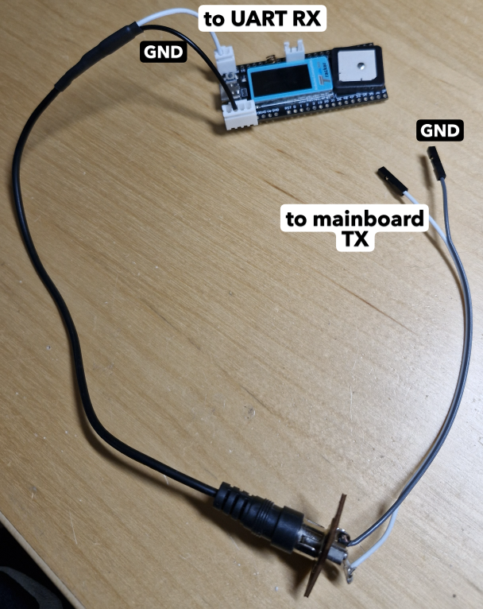
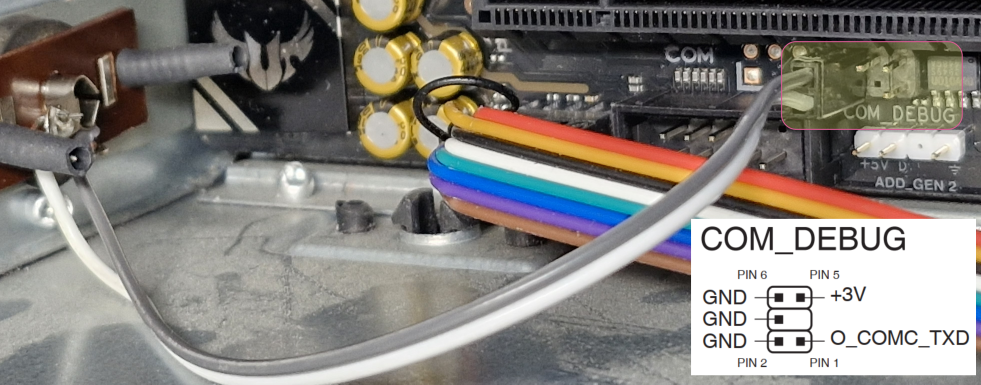

# ESPHome BIOS POST code gateway

## Abstract
This repository contains an [ESPHome](https://esphome.io) component `bios-post-code-gw` (short 'bpc') that reads POST codes received via UART from a PC mainboard and sends to your [HomeAssistant](https://www.home-assistant.io/) instance.

## Installation



With an ASUS motherboard using COM_DEBUG pin 1 (O_COMC_TXD) and pin 2 (GND):


## How to use

First you need to define a `uart` `rx_pin` to receive POST codes from the PC mainboard. Seems that pretty much all mainboards send at 115200 baudrate.

> **NOTE:** Consult your mainboard manual to find the TX pin. Not all mainboards have such possibility. Search for text like _LPC, Port 80, COM_DEBUG_.

```
uart:
  id: uart_bpc
  rx_pin: GPIO<x>
  baud_rate: 115200
```
Optionally, you can give the ESPHome device access to an SNTP server. Then it will add the time when a certain POST code is received to the `code_text` sensor.
```
# see https://esphome.io/components/time/sntp/
time:
  - platform: sntp
    id: sntp_time
    timezone: <your local timezone>
    servers:
      - 0.pool.ntp.org
      - 1.pool.ntp.org
      - 2.pool.ntp.org
```
**The list of configuration options**

 * `code`: Optional. Sensor that contain the POST code **value**.
 * `code_text`: Optional. Text Sensor that contains textual information about the POST code.
 * `time_id`: Optional. ID of the time source.
 * `post_code_descriptions`: List of POST codes and their descriptions. This repository contains a ready-made POST code list for current AMI-based motherboards, which can be included from your YAML with `!include <path-to>/bios-post-codes-ami.yaml`.
 * `ignore`: List of POST codes to ignore. An occurance of such codes are not published to HA.

### Example YAML
```
bios-post-code-gw:
  id: id_bpc
  code:
    name: "PC POST code"
    id: pc_post_code
  code_text:
    name: "PC POST code text"
    id: pc_post_code_text
  time_id: sntp_time
  post_code_descriptions: !include <path-to>/bios-post-codes-ami.yaml
  ignore: [
    0x9E, # Reserved for future AMI codes
    0x95, # PCI Bus Request Resources
  ]
```
### Include in your YAML
```
external_components:
  - source: github://realzoulou/esphome-bios-post-code-gw@main
```

## Format of `code_text`
Minimum format of the `code_text` text sensor

  _POST-code_ h | Δ _x_ ms

The milliseconds after Δ tells the milliseconds since the ***previous*** POST code was received.

### Examples
With time syncronization via `time_id` and with `post_code_descriptions` set:
```
01h | 17:05:17.480 | Δ 3 ms | SEC: Power on. Reset type detection (soft/hard)
```
**Without** time syncronization and no `post_code_descriptions` set:
```
01h | Δ 3 ms
```

## License
The sources in this repository are provided under `MIT` license.
